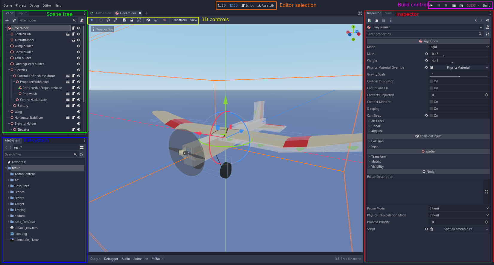
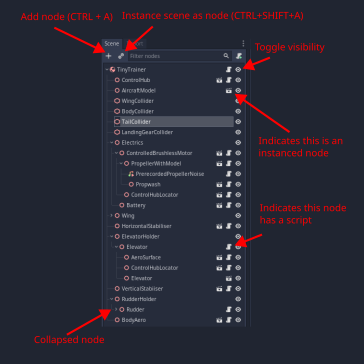

# Basics of the Godot Engine

This guide describes the basic features and concepts of the Godot game engine that are relevant to those developing addons for FOSS-RCAS.

## Nodes and Scenes

Nodes and scenes are the building blocks of Godot projects. A scene contains a tree of nodes, each of which can be of various types. Nodes can also have scripts attached, and this is the mechanism by which games are programmed. However, creating scripts is not required for creating new content. (In fact it's not even possible to use a custom script in an addon; all code used must be present in the base game).

Scenes are saved as `.tscn` files and can be included ("instanced") in other scenes. An aircraft and locations are saved as scenes, and most functionality used in content is achieved through instancing predefined scenes (EG `Wheel`) into your scene. Scenes can also inherit from other scenes, allowing base behavior and nodes to be shared between them. For instance, all locations should inherit from `Locations/Common/BaseLocation.tscn` to automatically get key components such as the air and the user interface.

## res://

You will notice that many paths used in the editor and in the project start with `res://`. `res://` simply points to the location of the root folder of the project.

## Interface

In this image, the main sections of the Godot editor shown when editing a scene have been annotated. They are described in the sections below. 

#### Scene tree

This is where you add and manipulate the nodes within a scene. The main controls are annotated below.

#### Filesystem

This shows the files within the project. 

#### Editor selection

This bar changes between the different editor types. When creating addons, only the 3d editor is needed.

#### 3D view & 3D controls

The 3d view is the largest part of the window and its' how the 3d elements of a scene are previewed and manipulated. At the top of the 3D view, there are a selection of tools such as move, scale and rotate. 

#### Inspector

The inspector's primary purpose is to change properties of the node that is currently selected in the scene tree. It is how scripts are assigned to nodes, through the dropdown at the very bottom.

#### Build controls

These control building and running the project. The most important ones are the play/restart button (on the far left), and the stop button (third from the left, useful if the game gets stuck). F5 is the shortcut to play.