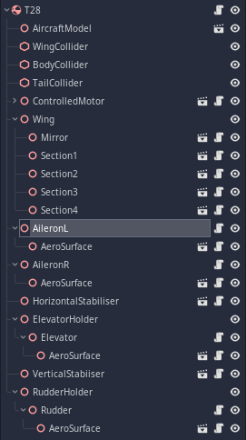

# Creating aircraft models for the simulator

This is a preliminary document and needs to be expanded on in the future.

## **This guide is currently incorrect**

It fails to mention the new ControlHub system that has been created.

## Prerequisites

While it might be technically possible to create models without installing the Godot engine, the easiest way to make models is to install the Godot engine (make sure to get the Mono version) and download this project from GitHub.

## Modelling

The modelling process can be done in whatever 3d software you want, provided that it can export to GLTF.

For your first model, it might be prefereable to skip this step and build the craft using the CSG primitives in Godot.

## Metadata and filesystem

A `.toml` file is used to define your aircraft and make it loadable. Below is an example file:

```toml
name = "My Amazing Plane" # display name
author = "Your name"
version = "0.1.0"
date_updated = 2023-01-31
description = """
This plane is very amazing. It flies beautifully.
"""

[aircraft]
wingspan = 0.75 # (metres)
length = 0.55
weight = 0.3 # (kilograms)
power_type = 4 # see the subsection "Power Types"
custom_power_type = "One jet and one prop" # If this is specified, overrides the power type specified above
channels = 4

[aircraft.launcher] # This section is optional, if it's not present then the craft is placed on the ground
speed = 10 # metres per second
height = 1.5 # metres above ground that it's launched from
angle = 30 # upward angle (in degrees) that the craft is launched at
```

The file should be located in a subfolder with the same name as itself. Along with this there should be a PNG thumbnail (1024x600px) and a .tscn file with the same name. For example:
```
Scenes
|-- Aircraft
    |-- MyAmazingPlane
    |   |-- MyAmazingPlane.png
    |   |-- MyAmazingPlane.toml
    |   |-- MyAmazingPlane.tscn
```

## Node setup

Here is an example node setup:


The base node of the aircraft needs to be a RigidBody with the `SpatialFluidEffectable` script attached. From there, you can tweak the RigidBody settings and add child nodes to achieve the desired flight characteristics.

The model should be constructed so that z-negative is forward, since this is the convention within Godot.

The aircraft simulation system is fairly modular. The following sections describe how various modules can be used.

Modules which apply force have a `Target` field, which should be set to point to the base RigidBody. However, if the module is a direct child of the base node, this is not necessary.

Not all module properties have been described, as many are fairly self-explanatory. 

#### Mirror

This mirrors its parent node around the parent's parents x axis. It works great for wings. It's not recommended to use this on aero surfaces or other moving things.

#### Aerodymanic surfaces

For creating surfaces such as wings and control surfaces, add an `AeroSurface` node. It simulates lift, induced drag and parasitic drag. Lift is generated when the surface is moved along its z-axis, a lesser amount of lift is generated when its moved along its y-axis.

The size of a surface is determined by its scale, which can be tweaked easily with the R key. Note that only the local scale of the surface is considered, scaling the parent will have no effect. You can also set the area multiplier to simulate a different shaped surface - for example, to make a triangular wing you could scale the surface to the bounds of the triangle, but set the multiplier to 0.5.

There are two curve parameters required. These find the lift or drag value for a specific AOA. They range from 0 to 90 degrees, other angles are interpolated from this curve. Some basic curves are provided in `Resources/AeroCurves/`.

When creating wings, it is recommended to create multiple smaller sections to create resistance to rolling (since `AeroSurfaces` don't simulate rotational drag). A `Mirror` node is very handy when doing wings this way.

Note that the center of pressure is in the middle of the surfaces, so you may want to move wings forward so that the CP is 1/4 to 1/3 of the way from the front of the actual wing.

#### Control surfaces

To create control surfaces, just add an `AeroSurface` as a child of a `ControlSurface`. Note that `ControlSurface` nodes rotate around their X axis. If you want them to rotate around a different axis, you need to add them as a child of another node, then rotate the parent node to get the X-axis in the right spot.

#### Motors

A basic propeller/edf motor can be created using a `Motor` . But this isn't controllable, so instead use a `ControlledMotor` node. The exit speed should be equivalent to the pitch speed of the motor/prop combination at full throttle. (ecalc is a useful tool to find such values)

#### Propwash

It's possible to simulate propwash by adding a `PropWash` node as a child of a Motor. To make the propwash actually do anything, it needs a `SpatialFluidBeacon` as a child.

#### Power types
```
Electric propeller      0
EDF                     1
Internal combustion     2
Turbine                 3
Other                   4
```

## Distributing

If your goal was to create an aircraft to be added to the base set, then no further distributing is needed. Simply create a pull request to the repository with your changes. Note that while new aircraft are currently welcome, some degree of quality is required, and at some point the base repository will stop accepting new models.

If you want to distribute your aircraft as an addon, unfortunately that is not possible yet. Currently there is no system for loading 3rd-party models. When there is, I need to write about how to make the paths relative so that addon craft can be loaded.